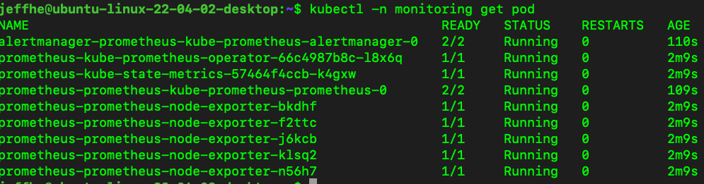
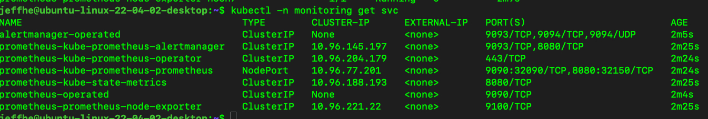
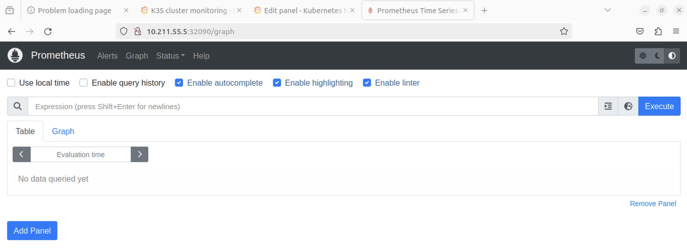

# 在 Kind 集群中安裝 Prometheus、Node Exporter 和 Kube-State-Metrics

## 作業說明

以下是如何使用 Helm 在 Kind 集群中部署 Prometheus、Node Exporter 和 Kube-State-Metrics，並包含之前所述的配置的詳細步驟：

### 1. 安裝 Helm

如果你還沒有安裝 Helm，可以使用以下命令來安裝：

```bash

curl https://raw.githubusercontent.com/helm/helm/main/scripts/get-helm-3 | bash

```

### 2. 添加 Prometheus Helm Repo

添加 Prometheus 的 Helm chart repository：

```bash

helm repo add prometheus-community https://prometheus-community.github.io/helm-charts
helm repo update

```

### 3. 創建 Kubernetes Namespace

首先，創建一個新的命名空間來安裝 Prometheus、Node Exporter 和 Kube-State-Metrics：

```bash
kubectl create namespace monitoring

```

### 4. 使用 Helm 部署 Prometheus

使用 Helm 部署 Prometheus，包括 Node Exporter 和 Kube-State-Metrics。你可以通過自定義 `values.yaml` 文件來配置 Prometheus：

創建一個名為 `values.yaml` 的文件

然後使用自定義的 `values.yaml` 文件來安裝 Prometheus：

```bash

helm upgrade --install prometheus prometheus-community/kube-prometheus-stack --namespace monitoring --create-namespace -f values.yaml

```

### 5. 檢查安裝狀態

檢查所有 Pod 和 Service 的狀態，確保它們都在 `Running` 狀態：

```bash

kubectl -n monitoring get pods
kubectl -n monitoring get svc

```




### 6. GUI

