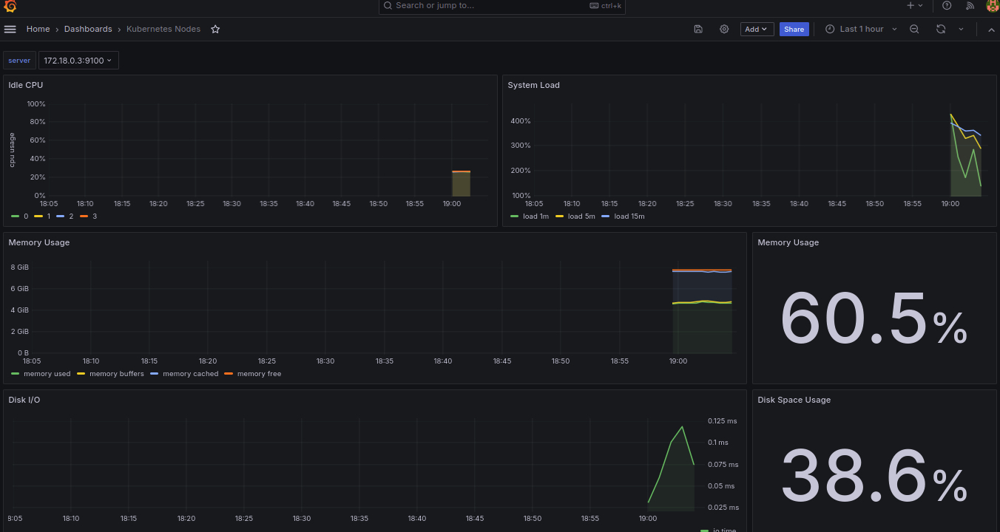
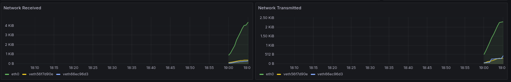
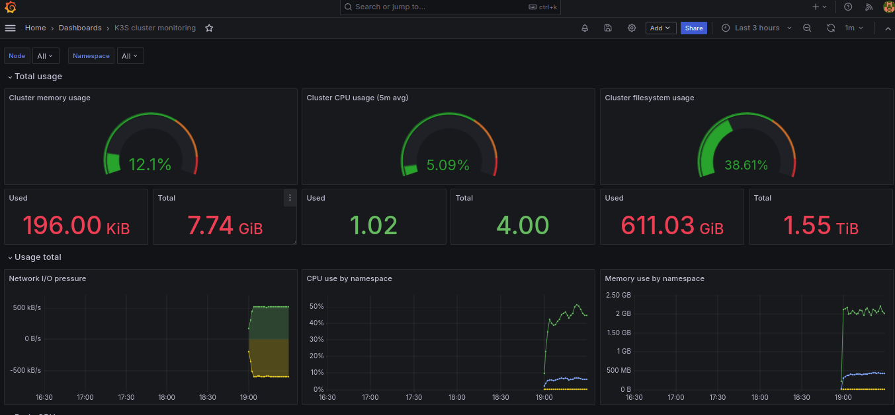
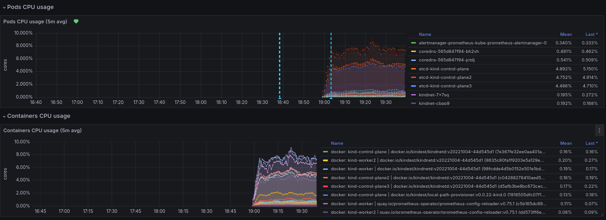
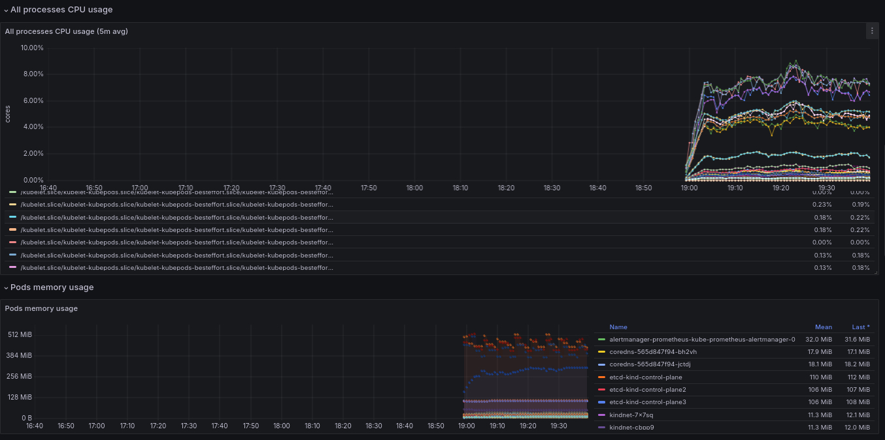
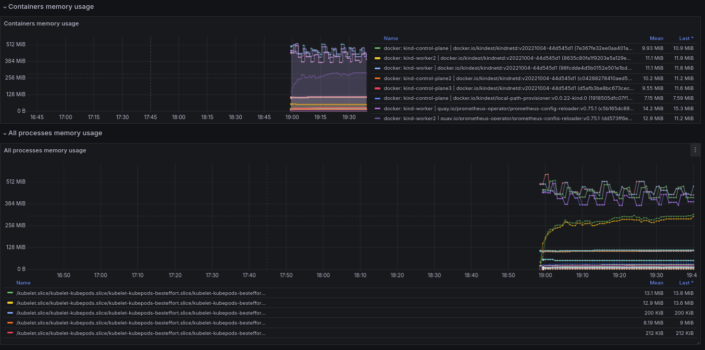

# Grafana

## 作業說明

### 1. 創建 Docker Compose 文件

首先，在你的工作目錄中創建一個 `docker-compose.yml` 文件

### 2. 運行 Docker Compose

在包含 `docker-compose.yml` 文件的目錄中運行以下命令來啟動 Grafana 服務：

```bash

docker-compose up -d

```

這個命令將會在後台運行 Grafana 容器，並將本地的 3000 端口映射到容器的 3000 端口。你可以通過瀏覽器訪問 `http://localhost:3000` 來打開 Grafana 界面。

### 3. 訪問 Grafana Web 界面

打開你的瀏覽器，訪問 `http://localhost:3000`。默認的登錄憑證是：

- 用戶名：`admin`
- 密碼：`admin`

在首次登錄時，系統會提示你更改密碼。

### 4. 添加 Prometheus 作為數據源

1. 登錄到 Grafana Web 界面。
2. 點擊左側菜單中的齒輪圖標 (設定)，然後選擇 “Data Sources”。
3. 點擊 “Add data source” 按鈕。
4. 在搜索框中輸入 `Prometheus`，然後選擇 `Prometheus`。
5. 在 `HTTP` 部分的 `URL` 欄位中，輸入你的 Prometheus 服務地址，例如 `http://localhost:9090`。
6. 滾動到頁面底部，點擊 “Save & Test” 按鈕，確保連接成功。

### 5.1 效能監控儀表板(1): 呈現node的效能監控數據




#### 面板 1: CPU 使用度

- **名稱:** CPU Usage
- **查詢:**

  ```
  100 - (avg by (cpu) (irate(node_cpu_seconds_total{mode="idle", instance="$server"}[5m])) * 100)

  ```
- **說明:** 此面板顯示每個CPU核心的使用度百分比，表示當前被使用的CPU時間。高使用度百分比表示CPU負載較高。

#### 面板 2: 系統負載

- **名稱:** System Load
- **查詢:**

  ```
  node_load1{instance="$server"}

  ```
- **說明:** 此面板顯示系統在過去1分鐘內的平均負載。這是一個整體的負載指標，反映了系統的繁忙程度。

#### 面板 3: 記憶體使用量

- **名稱:** Memory Usage
- **查詢:**

  ```
  node_memory_MemTotal_bytes{instance="$server"} - node_memory_MemFree_bytes{instance="$server"} - node_memory_Buffers_bytes{instance="$server"} - node_memory_Cached_bytes{instance="$server"}

  ```
- **說明:** 此面板顯示節點的實際記憶體使用量，扣除空閒、緩衝區和快取的記憶體後的使用量。

#### 面板 4: 記憶體使用率

- **名稱:** Memory Usage Percentage
- **查詢:**

  ```
  ((node_memory_MemTotal_bytes{instance="$server"} - node_memory_MemFree_bytes{instance="$server"}  - node_memory_Buffers_bytes{instance="$server"} - node_memory_Cached_bytes{instance="$server"}) / node_memory_MemTotal_bytes{instance="$server"}) * 100

  ```
- **說明:** 此面板顯示節點的記憶體使用率，以百分比表示。高記憶體使用率可能表示記憶體資源緊張。

#### 面板 5: 磁碟 I/O

- **名稱:** Disk I/O
- **查詢:**

  ```
  sum by (instance) (rate(node_nfsd_disk_bytes_read_total{instance="$server"}[2m]))

  ```
- **說明:** 此面板顯示節點的磁碟讀取速率，反映了磁碟I/O操作的頻率和密集程度。

#### 面板 6: 磁碟空間使用率

- **名稱:** Disk Space Usage
- **查詢:**

  ```
  (sum(node_filesystem_size_bytes{device!="rootfs",instance="$server"}) - sum(node_filesystem_free_bytes{device!="rootfs",instance="$server"})) / sum(node_filesystem_size_bytes{device!="rootfs",instance="$server"})

  ```
- **說明:** 此面板顯示節點的磁碟空間使用率，以百分比表示。高磁碟使用率可能表示需要清理或擴展磁碟空間。

#### 面板 7: 網路接收速率

- **名稱:** Network Received
- **查詢:**

  ```
  rate(node_network_receive_bytes_total{instance="$server",device!~"lo"}[5m])

  ```
- **說明:** 此面板顯示節點的網路接收速率，反映了網路流量的接收情況。

#### 面板 8: 網路傳輸速率

- **名稱:** Network Transmitted
- **查詢:**

  ```
  rate(node_network_transmit_bytes_total{instance="$server",device!~"lo"}[5m])

  ```
- **說明:** 此面板顯示節點的網路傳輸速率，反映了網路流量的傳輸情況。

這些面板共同提供了一個全面的節點效能監控儀表板，幫助你監控和分析節點的CPU、記憶體、磁碟和網路資源的使用情況。

### 5.2 效能監控儀表板(2): 顯示kind叢集的效能監控數據







#### 面板 1: Cluster Memory Usage

- **名稱:** Cluster Memory Usage
- **查詢:**

  ```
  sum(container_memory_working_set_bytes{node=~"^$Node$"}) / sum(machine_memory_bytes{node=~"^$Node$"}) * 100

  ```
- **說明:** 此面板顯示集群中所有節點的內存使用百分比，表示當前被使用的內存量。

#### 面板 2: Used Memory

- **名稱:** Used Memory
- **查詢:**

  ```
  container_memory_usage_bytes

  ```
- **說明:** 此面板顯示當前容器使用的內存量。

#### 面板 3: Total Memory

- **名稱:** Total Memory
- **查詢:**

  ```
  machine_memory_bytes{}

  ```
- **說明:** 此面板顯示集群中所有節點的總內存量。

#### 面板 4: Cluster CPU Usage (5m avg)

- **名稱:** Cluster CPU Usage (5m avg)
- **查詢:**

  ```
  sum(rate(container_cpu_usage_seconds_total{node=~"^$Node$"}[5m])) / sum(machine_cpu_cores{node=~"^$Node$"}) * 100

  ```
- **說明:** 此面板顯示集群中所有節點的CPU使用百分比，使用5分鐘的平均值來表示。

#### 面板 5: Used CPU

- **名稱:** Used CPU
- **查詢:**

  ```
  sum(rate(container_cpu_usage_seconds_total{node=~"^$Node$"}[5m]))

  ```
- **說明:** 此面板顯示集群中所有節點的已使用CPU秒數，使用5分鐘的平均值來表示。

#### 面板 6: Total CPU Cores

- **名稱:** Total CPU Cores
- **查詢:**

  ```
  machine_cpu_physical_cores

  ```
- **說明:** 此面板顯示集群中所有節點的物理CPU核心總數。

#### 面板 7: Cluster Filesystem Usage

- **名稱:** Cluster Filesystem Usage
- **查詢:**

  ```
  ((sum(node_filesystem_size_bytes{node=~"^$Node$"}) - sum(node_filesystem_free_bytes{node=~"^$Node$"})))/ sum(node_filesystem_size_bytes{node=~"^$Node$"}) * 100

  ```
- **說明:** 此面板顯示集群中所有節點的文件系統使用百分比，表示當前被使用的存儲空間量。

#### 面板 8: Used Filesystem Space

- **名稱:** Used Filesystem Space
- **查詢:**

  ```
  (sum(node_filesystem_size_bytes{node=~"^$Node$"}) - sum(node_filesystem_free_bytes{node=~"^$Node$"}))

  ```
- **說明:** 此面板顯示集群中所有節點的已使用文件系統空間。

#### 面板 9: Total Filesystem Space

- **名稱:** Total Filesystem Space
- **查詢:**

  ```
  sum(node_filesystem_size_bytes{node=~"^$Node$"})

  ```
- **說明:** 此面板顯示集群中所有節點的總文件系統空間。

#### 面板 10: Network I/O Pressure

- **名稱:** Network I/O Pressure
- **查詢:**

  ```
  sum(rate(container_network_receive_bytes_total{node=~"^$Node$"}[5m]))
  sum(rate(container_network_transmit_bytes_total{node=~"^$Node$"}[5m]))

  ```
- **說明:** 此面板顯示集群中所有節點的網絡接收和發送流量速率，使用5分鐘的平均值來表示。

#### 面板 11: CPU Use by Namespace

- **名稱:** CPU Use by Namespace
- **查詢:**

  ```
  sum(rate(container_cpu_usage_seconds_total{image!="",node=~"^$Node$",namespace=~"$Namespace"}[5m])) by (namespace)

  ```
- **說明:** 此面板顯示每個命名空間的CPU使用情況，使用5分鐘的平均值來表示。

#### 面板 12: Memory Use by Namespace

- **名稱:** Memory Use by Namespace
- **查詢:**

  ```
  sum(container_memory_working_set_bytes{image!="",node=~"^$Node$",namespace=~"$Namespace"}) by (namespace)

  ```
- **說明:** 此面板顯示每個命名空間的內存使用情況。

#### 面板 13: Pods CPU Usage (5m avg)

- **名稱:** Pods CPU Usage (5m avg)
- **查詢:**

  ```
  sum(rate(container_cpu_usage_seconds_total{image!="",node=~"^$Node$",namespace=~"$Namespace"}[5m])) by (pod)

  ```
- **說明:** 此面板顯示每個Pod的CPU使用情況，使用5分鐘的平均值來表示。

#### 面板 14: Containers CPU Usage (5m avg)

- **名稱:** Containers CPU Usage (5m avg)
- **查詢:**

  ```
  sum(rate(container_cpu_usage_seconds_total{image!="",name=~"^k8s_.*",container_name!="POD",node=~"^$Node$",namespace=~"$Namespace"}[5m])) by (container_name, pod)

  ```
- **說明:** 此面板顯示docker層(Kind Node)每個容器的CPU使用情況，使用5分鐘的平均值來表示。

#### 面板 15: All Processes CPU Usage (5m avg)

- **名稱:** All Processes CPU Usage (5m avg)
- **查詢:**

  ```
  sum(rate(container_cpu_usage_seconds_total{id!="/",node=~"^$Node$",namespace=~"$Namespace"}[5m])) by (id)

  ```
- **說明:** 此面板顯示所有進程的CPU使用情況，使用5分鐘的平均值來表示。

#### 面板 16: Pods Memory Usage

- **名稱:** Pods Memory Usage
- **查詢:**

  ```
  sum(container_memory_working_set_bytes{image!="",node=~"^$Node$",namespace=~"$Namespace"}) by (pod)

  ```
- **說明:** 此面板顯示每個Pod的內存使用情況。

#### 面板 17: Containers Memory Usage

- **名稱:** Containers Memory Usage
- **查詢:**

  ```
  sum(container_memory_working_set_bytes{image!="",name=~"^k8s_.*",container_name!="POD",node=~"^$Node$",namespace=~"$Namespace"}) by (container_name, pod)
  sum(container_memory_working_set_bytes{image!="",name!~"^k8s_.*",node=~"^$Node$",namespace=~"$Namespace"}) by (node, name, image)

  ```
- **說明:** 此面板顯示docker層(Kind Node)每個容器的內存使用情況。

#### 面板 18: All Processes Memory Usage

- **名稱:** All Processes Memory Usage
- **查詢:**

  ```
  sum(container_memory_working_set_bytes{id!="/",node=~"^$Node$",namespace=~"$Namespace"}) by (id)

  ```
- **說明:** 此面板顯示所有進程的內存使用情況。

#### 面板 19: Pods Network I/O (5m avg)

- **名稱:** Pods Network I/O (5m avg)
- **查詢:**

  ```
  sum(rate(container_network_receive_bytes_total{image!="",node=~"^$Node$",namespace=~"$Namespace"}[5m])) by (pod)
  sum(rate(container_network_transmit_bytes_total{image!="",node=~"^$Node$",namespace=~"$Namespace"}[5m])) by (pod)

  ```
- **說明:** 此面板顯示每個Pod的網絡接收和發送流量速率，使用5分鐘的平均值來表示。

#### 面板 20: Containers Network I/O (5m avg)

- **名稱:** Containers Network I/O (5m avg)
- **查詢:**

  ```
  sum(rate(container_network_receive_bytes_total{image!="",name=~"^k8s_.*",node=~"^$Node$",namespace=~"$Namespace"}[5m])) by (container_name, pod)
  sum(rate(container_network_transmit_bytes_total{image!="",name=~"^k8s_.*",node=~"^$Node$",namespace=~"$Namespace"}[5m])) by (container_name, pod)
  sum(rate(container_network_receive_bytes_total{image!="",name!~"^k8s_.*",node=~"^$Node$",namespace=~"$Namespace"}[5m])) by (node, name, image)
  sum(rate(container_network_transmit_bytes_total{image!="",name!~"^k8s_.*",node=~"^$Node$",namespace=~"$Namespace"}[5m])) by (node, name, image)
  sum(rate(container_network_transmit_bytes_total{rkt_container_name!="",node=~"^$Node$",namespace=~"$Namespace"}[5m])) by (node, rkt_container_name)
  sum(rate(container_network_transmit_bytes_total{rkt_container_name!="",node=~"^$Node$",namespace=~"$Namespace"}[5m])) by (node, rkt_container_name)

  ```
- **說明:** 此面板顯示docker層(Kind Node)每個容器的網絡接收和發送流量速率，使用5分鐘的平均值來表示。


### 5.3 觀察CPU Throttling

可觀察Pods CPU Usage (5m avg)中每個pod的CPU使用比例，對應每個服務設定的limits requests來判定使否有出現CPU Throttling。

